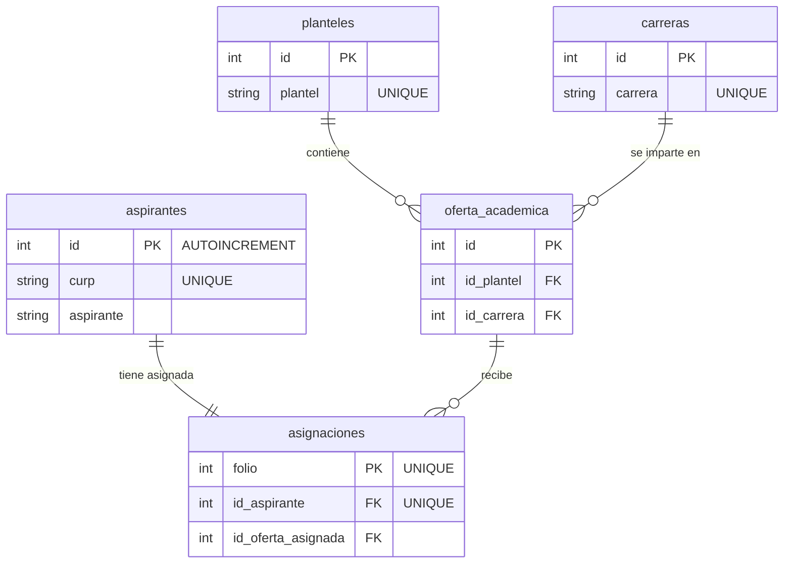

# Gestión de Base de Datos de aspirantes de una institución académica

Se realiza una base de datos con la estructura como se indica más abajo. Tiene como finalidad extraer de un `csv` los datos de aspirantes de un colegio y con el uso de `Python` introducirlo dentro de una base de datos en `SQLite` para la consulta y obtención de información para inteligencia de negocio.

## Licencia

Este proyecto está licenciado bajo la Licencia MIT. Para más detalles consulta el archivo [LICENSE](LICENSE).

## Autor

Proyecto desarrollado por **Rosendo Camal**.

Contacto:
* [`GitHub`](https://github.com/rosendocamal)
* [`Linkedin`](https://www.linkedin.com/in/rosendocamal)