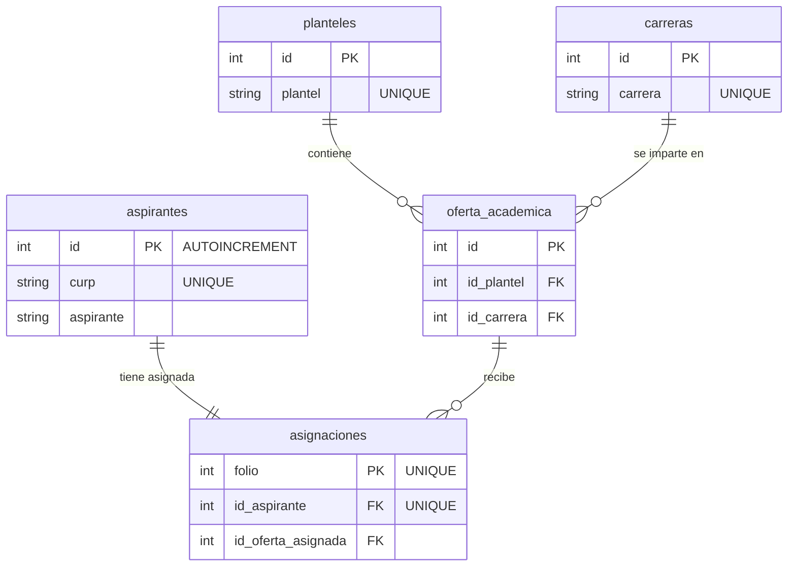

# Gestión de Base de Datos de aspirantes de una institución académica

```mermaid
erDiagram
    planteles {
        int id PK
        string plantel "UNIQUE"
    }

    carreras {
        int id PK
        string carrera "UNIQUE"
    }

    oferta_academica {
        int id PK
        int id_plantel FK
        int id_carrera FK
    }

    aspirantes {
        int id PK "AUTOINCREMENT"
        string curp "UNIQUE"
        string aspirante
    }

    asignaciones {
        int folio PK "UNIQUE"
        int id_aspirante FK "UNIQUE"
        int id_oferta_asignada FK
    }

    planteles ||--o{ oferta_academica : "contiene"
    carreras ||--o{ oferta_academica : "se imparte en"
    aspirantes ||--|| asignaciones : "tiene asignada"
    oferta_academica ||--o{ asignaciones : "recibe"
```
